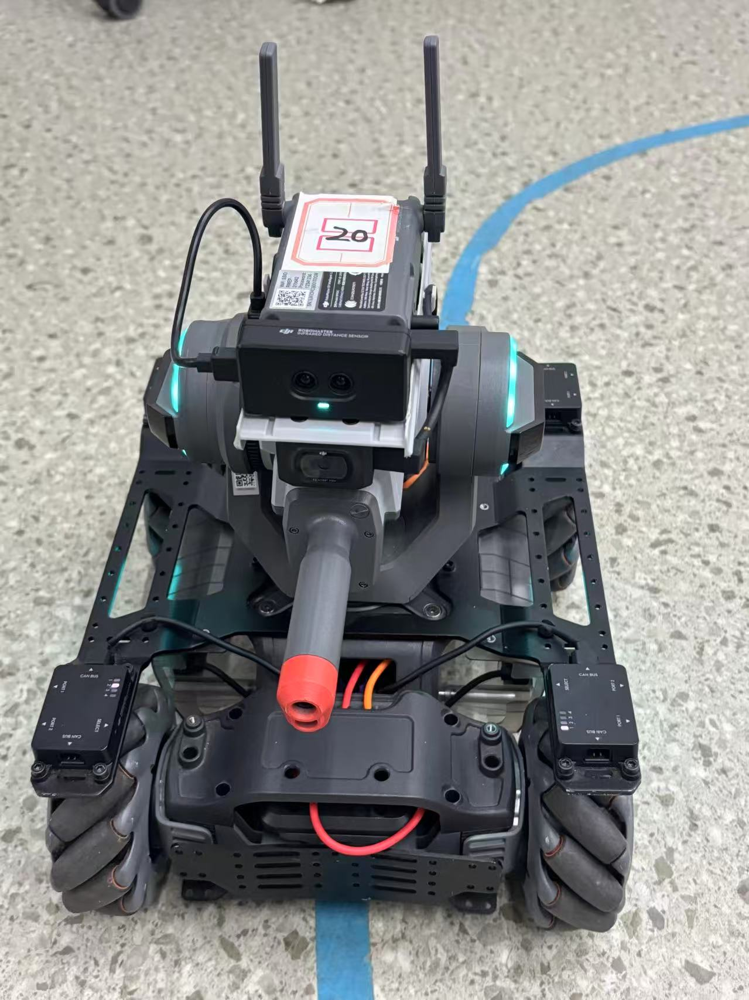

# final-robot-exam

Code project for **Group 20** of the **2024 Sino-Foreign Cooperative Computer Science Program**  
at **Ocean University of China (OUC)** for the **RoboMaster 1** course.

## Project Introduction

This repository is the **RoboMaster 1** code project of **Group 20** from the **2024 OUC Sino-Foreign Cooperative Computer Science Program**. It is used to store the program code developed during robot course experiments, function implementation, debugging, and testing.

The project is based on the RoboMaster platform and mainly includes robot basic control, function implementation, debugging, verification, and course assessment-related content. This repository is intended to record our group’s development results, facilitate team collaboration, support version management, and make future maintenance easier.

## Project Objectives

- Complete the functional development required for the RoboMaster 1 course
- Implement basic robot control and task logic
- Support collaborative development and code management among team members
- Record the project development process and experimental results
- Provide a code foundation for future presentation, evaluation, and summary

## Our Robot

## Team Members

This project was completed by **Group 20** of the **2024 Sino-Foreign Cooperative Computer Science Program** at **Ocean University of China**.

> - monessss  
> - 牢大  
> - yanshu  
> - hercu  

## Project Content

This repository is mainly used to store the following content:

- RoboMaster robot control code
- Sensor data reading and processing code
- Motion control and task execution logic
- Debugging and testing code
- Course experiment or assessment-related programs

If the repository continues to be updated, it can also serve as a development record and version archive for the group project.

## Runtime Environment

### Hardware Platform

- RoboMaster robot platform
- Related sensors and peripherals

### Software Environment

- Programming Language: `Python`
- Development Tool: `VS Code`
- Operating System: `Windows`

# final-robot-exam

中国海洋大学（OUC）2024级中外合作计算机科学与技术专业  
20 小组 **RoboMaster 1** 课程代码项目

## 项目简介

本仓库为中国海洋大学 2024 级中外合作计算机科学与技术专业 20 小组的 **RoboMaster 1** 课程项目代码仓库，用于保存机器人课程实验、功能开发、调试测试及课程考核过程中所编写的程序代码。

项目基于 RoboMaster 平台开展，主要涉及机器人基础控制、功能实现、调试验证以及课程项目相关内容。该仓库旨在记录小组项目开发过程中的代码成果，便于团队协作、版本管理以及后续维护。

## 项目目标

- 完成 RoboMaster 1 课程项目所需功能的开发
- 实现机器人基础控制与任务逻辑
- 支持小组成员之间的协作开发与代码管理
- 记录项目开发过程与实验结果
- 为后续展示、验收与总结提供代码基础

## 我们的机器人

## 项目成员

本项目由中国海洋大学 2024 级中外合作计算机科学与技术专业 20 小组完成。

> - monessss  
> - 牢大  
> - yanshu  
> - hercu  

## 项目内容

本仓库主要用于保存以下内容：

- RoboMaster 机器人控制代码
- 传感器数据读取与处理代码
- 运动控制与任务执行逻辑
- 调试与测试代码
- 课程实验或考核相关程序

如果后续持续更新，本仓库也可作为小组项目开发记录与版本归档使用。

## 运行环境

### 硬件平台

- RoboMaster 机器人平台
- 相关传感器与外设

### 软件环境

- 编程语言：`Python`
- 开发工具：`VS Code`
- 操作系统：`Windows`
